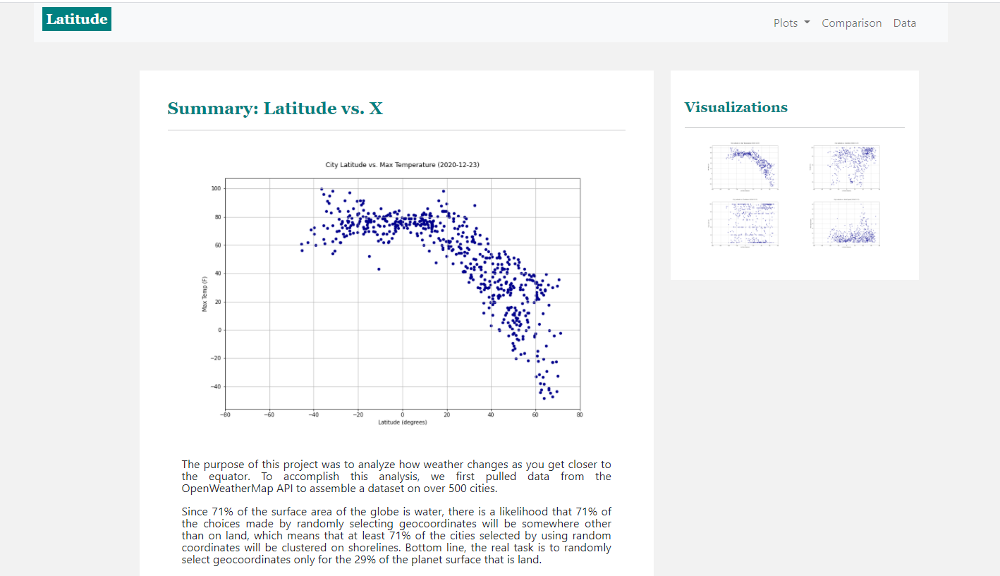

**Web Visualization Dashboard (Latitude)**

**Summary / Folder Contents**

Please find in the repository the following items:

-   7 core HTML files: index, comparison, temperature, humidity, cloudiness,
    wind speed, and data

-   An additional 8 HTML files dedicated to individual images, named as Fig1-A,
    Fig 1-B, Fig 2-A... which provide full-size views of the Northern and
    Southern Hemisphere graphs

-   A Resources folder with four subfolders: assets, css, data, and js. The
    assets folder contains an image folder.

-   A series of backup folders with dates in their folder-names that
    collectively show the evolution of my efforts.

**Live Web Site Link**

The repository does not contain the live website. That website can be reached at
https://nubee65.github.io/.

**Thoughts**

This portion of the project involved serving up the findings as web pages. I
utilized HTML, Cascading Style Sheets (CSS), and Bootstrap templates. This
effort was prior to my learning extensive use of JavaScript and a number of its
libraries. All links function cleanly, allowing easy navigation between pages.
This includes links assigned to small-size images. The page formatting is clean.
The code is reasonably modular and easy to follow.
